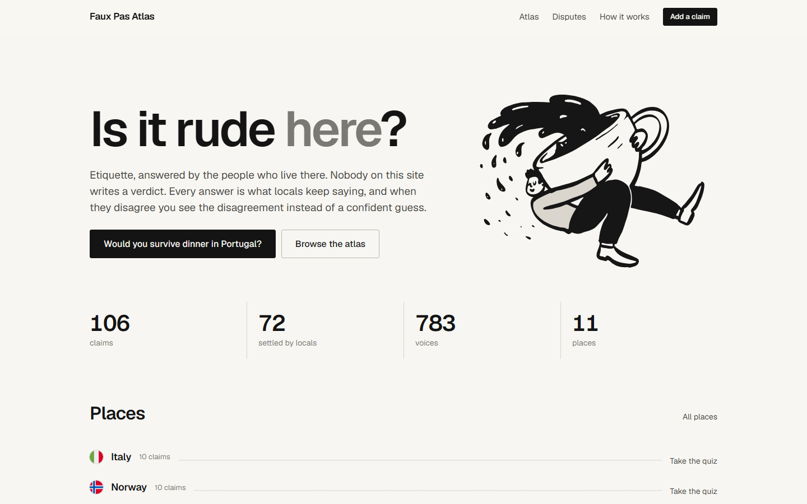
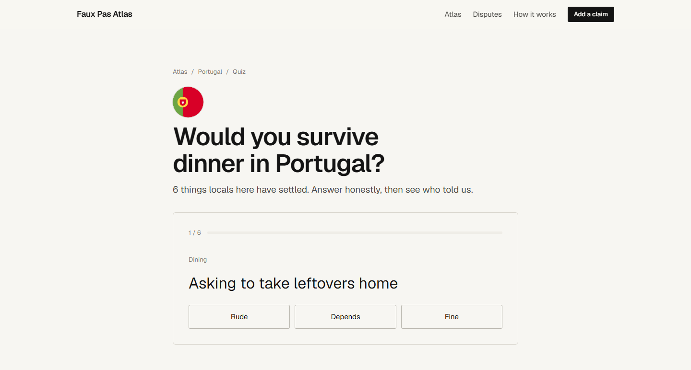
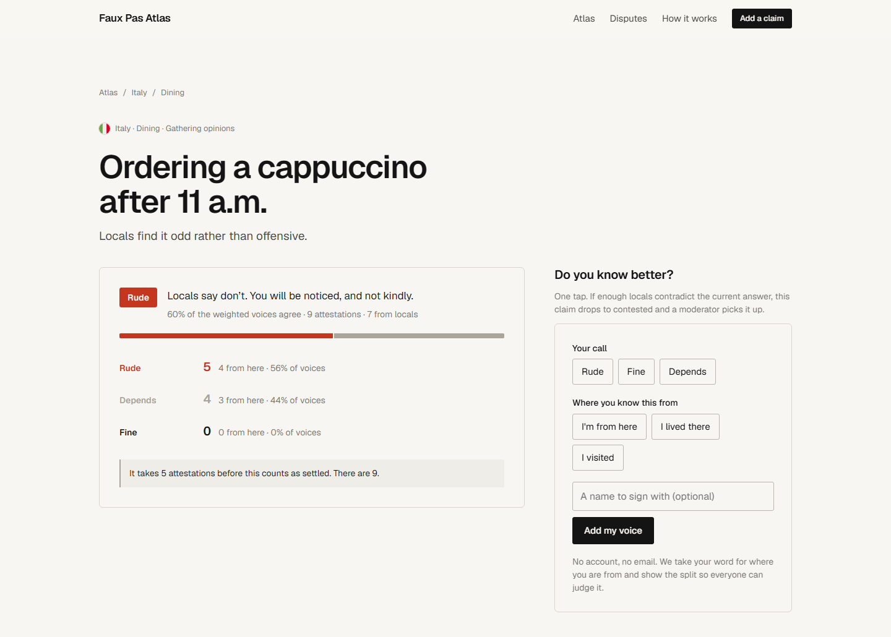
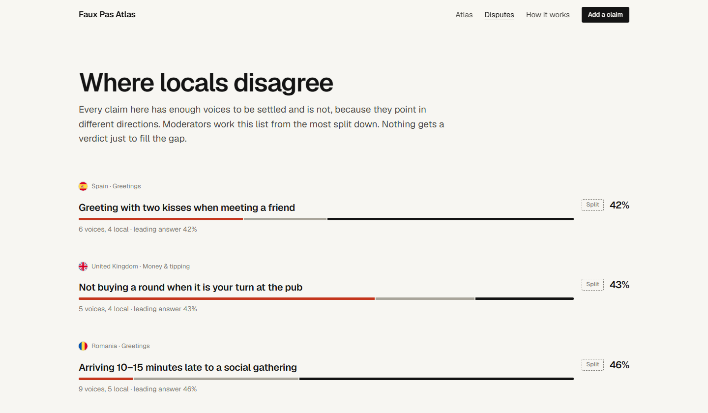
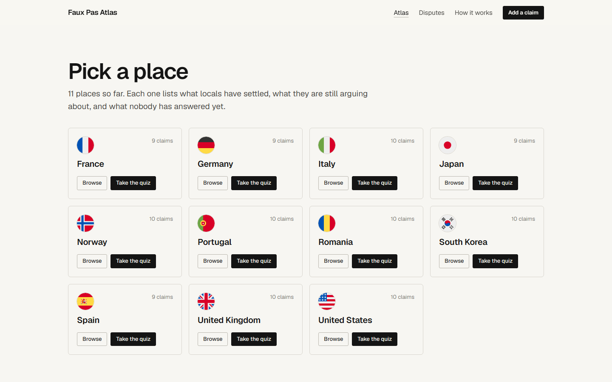

# Faux Pas Atlas

**Is it rude here?** An etiquette atlas where every answer is the consensus of
people who live there. Nobody writes a verdict. A claim like *"Tipping at a
restaurant"* in Japan has no stance stored anywhere: the verdict is computed
from local attestations every time it is shown, and when locals disagree the
site shows the split instead of picking a side.

Live: **https://faux-pas-atlas.xocoweb.workers.dev**

Built for the [Sanity Challenge on DEV](https://dev.to/challenges/sanity-2026-09-16),
Path 2: *"Vibe-code something strange"*. The whole thing was prompted into
existence with Claude Code in VS Code. The honest record of how that went, dead
ends included, is in [docs/build-log.md](docs/build-log.md); the plan it was
built against, with what got cut, is [PLAN.md](PLAN.md).



## How it works

- A **claim** is one behaviour, in one place, in one situation. The document
  holds the statement, two references and a workflow stage. No verdict field.
- Anyone can **attest**: rude, fine or depends, and how they know the place.
  Locals count double, visitors half. No account needed.
- A claim becomes **settled** at five voices, three of them local, with 70%
  weighted agreement. Below 55% it goes to the **contested** board, where it
  stays visible with the disagreement on display.
- Anyone can **propose** a claim. A Function asks a model whether it is a real
  etiquette claim and whether it duplicates one already filed. Only a clean
  pass opens for attestation; everything else waits for a moderator.
- Anyone can **dispute** a settled claim in writing. A moderator keeps it,
  splits it into narrower claims, or retires it. Retired claims keep their
  history; they just stop being shown.
- Settled claims nobody has confirmed in a year **reopen** by themselves.
- Every place has a quiz, *"Would you survive dinner in Portugal?"*, built
  only from settled claims.

## Sanity features used

| Feature | Where |
|---|---|
| Content Lake, GROQ | Everything. The verdict is a GROQ projection over attestations, recomputed on every read. |
| Studio v6 + `@sanity-labs/sanity-plugin-workflows` | Two workflows: claim (Proposed → Attesting → Canon, off-ramps Contested and Retired) and dispute (Opened → Evidence → Ruling → Closed). Functions and the moderator app write to the same audit trail the plugin reads. |
| Functions (Blueprints) | `recompute-agreement` on every attestation write, `claim-dedupe` on every proposal, `expiry-sweep` daily. |
| Agent Actions | `claim-dedupe` uses one `prompt` call per proposal to judge whether it is a genuine etiquette claim and whether it duplicates an existing one. One credit per proposal, never re-run. |
| App SDK | **Dispute Board**, a moderator app in the Sanity Dashboard: live queue of split and disputed claims, weighted spread by locality, who is behind the numbers with each attester's track record, one-transaction rulings (keep / split / retire), presence, and a Proposals queue for what the automatic check held back. |

Everything runs on the Sanity Free plan.

## Screenshots

| | |
|---|---|
|  The quiz, built from settled claims only |  A contested claim shows the split, never a stance |
|  Where locals disagree |  The atlas by place |

## Project layout

```
studio/         Sanity Studio: schema, workflow definitions, seed and check scripts
web/            Astro 7 site on Cloudflare Workers; write endpoints under /api
functions/      Sanity Functions and the Blueprint that deploys them
dispute-board/  App SDK moderator app, deployed to the Sanity Dashboard
shared/         GROQ projections and the consensus rule, used by all of the above
docs/           Build log, screenshots, the DEV post
```

The consensus rule lives in one place, `shared/src/consensus.ts`, so the
Functions, the site and the moderator app can never disagree about a verdict.
The same file derives an attester's track record: how often their past answers
matched what locals later settled on. Nothing about trust is stored.

## Sanity project

- Studio: https://faux-pas-atlas.sanity.studio (project members only)
- Project ID: `dh2oc30x`
- Dataset: `production` (public)
- Try a query without a token:
  `https://dh2oc30x.api.sanity.io/v2026-04-12/data/query/production?query=*[_type=="claim"][0..4]{statement,status}`

## Running it

Node 22.12 or newer and pnpm.

```sh
pnpm install

pnpm studio   # Studio at http://localhost:3333
pnpm web      # Site at http://localhost:4321
pnpm board    # Dispute Board at http://localhost:3333 (needs a Sanity login)
```

The site reads the public dataset with no configuration. The write endpoints
need a Sanity token with Editor rights in `web/.env` as `SANITY_WRITE_TOKEN`
(see `web/.env.example`). In production the token is a Cloudflare Worker
secret; `web/wrangler.jsonc` sets `keep_vars` so deploys do not wipe it.

Seed content and workflow definitions are created with the scripts in
`studio/scripts`, run through `sanity exec --with-user-token`:

```sh
cd studio
npx sanity exec scripts/seed-workflows.ts --with-user-token
npx sanity exec scripts/seed-content.ts --with-user-token
npx sanity exec scripts/seed-disputes.ts --with-user-token
```

Deploys: the site ships on every push to `main` through Cloudflare Workers
Builds (`pnpm --filter web ship` does it by hand). Functions deploy from
`functions/` with `npx sanity blueprints deploy`. The board deploys from
`dispute-board/` with `npx sanity deploy`.

## Honest caveats

- Where an attester is from is self-declared. The site trusts people and shows
  the split so everyone can judge it. The moderator app shows each attester's
  track record so a suspicious spread can be read, not just counted.
- One person, one vote is enforced by a stable id per name or address. It stops
  the casual double vote, not a determined one with a script and a VPN.
- Attestation notes and dispute reasons are published as written. Proposals are
  gated by a model and a moderator; notes are not yet.
- The seed claims were drafted with an AI from common travel-etiquette
  knowledge, then reviewed by hand. They are a starting point, not an
  authority. That is rather the point of the site.
- The Free plan has only Administrator and Viewer roles, so moderator is a
  workflow role, not a Sanity permission.

## Credits

Flags from [circle-flags](https://github.com/HatScripts/circle-flags) (MIT).
Drawings from [Open Doodles](https://www.opendoodles.com/) (CC0), recoloured.
Typeface: [Geist](https://vercel.com/font) (OFL).

MIT licence.
